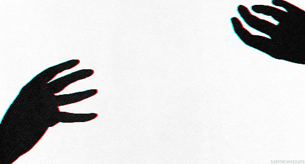

<p align="center">
  <a href="https://guns.lol/nvd">
    
  </a>
</p>

> external_endpoint = armed

```ini
[user]
name = "nvdlove"
alias = "phantom"
focus = "systems architecture & automation"
status = "active"

[core]
languages = [ "C#", "C++", "Rust", "Node.js", "Python", "Lua" ]
specialties = [ "backend-automation", "high-performance-systems", "api-architecture", "reverse-engineering" ]

[infrastructure]
endpoint = "armed"
observing = true
